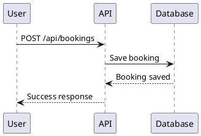

# Инструменты для создания схем проекта

## ✅ Текущее решение: Mermaid диаграммы

В проекте уже используется **Mermaid** для создания диаграмм. Все диаграммы находятся в файле `PROJECT_DIAGRAMS.md`.

### Просмотр диаграмм:

1. **В GitHub/GitLab** - диаграммы рендерятся автоматически
2. **В VS Code** - установите расширение "Markdown Preview Mermaid Support"
3. **Онлайн** - https://mermaid.live/ (скопируйте код диаграммы)
4. **Локально** - откройте `PROJECT_DIAGRAMS.md` в редакторе с поддержкой Mermaid

## 🔧 Альтернативные инструменты

### 1. Laravel Model Visualizer (рекомендуется)

```bash
# Установка через composer
composer require --dev laravel-modeler/laravel-modeler

# Генерация диаграммы
php artisan modeler:generate
```

### 2. PlantUML (для UML диаграмм)

**Установка:**
```bash
# Ubuntu/Debian
sudo apt-get install plantuml

# Или через Docker
docker run -it --rm -v $(pwd):/work plantuml/plantuml:latest diagram.puml
```

**Использование:**
Создайте файл `diagrams/sequence.puml`:


Затем сгенерируйте изображение:
```bash
plantuml diagrams/sequence.puml
```

### 3. Laravel Schema Generator

```bash
composer require --dev kitloong/laravel-migrations-generator
php artisan migrate:generate --tables=users,bookings,excursions
```

### 4. Graphviz (для схем графов)

```bash
# Установка
sudo apt-get install graphviz

# Создание диаграммы из .dot файла
dot -Tpng diagram.dot -o diagram.png
```

### 5. Draw.io / diagrams.net (визуальный редактор)

- Онлайн: https://app.diagrams.net/
- Desktop версия доступна
- Поддерживает экспорт в различные форматы

## 📊 Рекомендуемый подход

Для данного проекта рекомендуется:

1. **Mermaid** (уже используется) - для документации в README/MD
   - ✅ Простой синтаксис
   - ✅ Поддерживается GitHub/GitLab
   - ✅ Не требует дополнительных инструментов

2. **PlantUML** - для сложных UML диаграмм
   - Sequence diagrams
   - Class diagrams
   - Activity diagrams

3. **Laravel Modeler** - для автоматической генерации ER диаграмм из моделей

## 🚀 Быстрый старт с Mermaid

Все диаграммы уже созданы в `PROJECT_DIAGRAMS.md`. Для просмотра:

1. Откройте файл в VS Code с расширением Mermaid
2. Или скопируйте код диаграммы на https://mermaid.live/
3. Или используйте GitHub/GitLab для автоматического рендеринга

## 📝 Примеры диаграмм в проекте

В `PROJECT_DIAGRAMS.md` находятся:
- ✅ Общая архитектура системы
- ✅ ER диаграмма базы данных
- ✅ Схема API endpoints
- ✅ Sequence диаграммы (бронирование, отмена)
- ✅ Схема ролей и прав доступа
- ✅ Схема расчета прибыли
- ✅ Схема взаимодействия Frontend/Backend
- ✅ Структура директорий

## 🔄 Автоматическая генерация ER диаграмм

Для автоматической генерации ER диаграммы из миграций Laravel:

```bash
# Вариант 1: Использовать artisan команду (если есть пакет)
php artisan schema:diagram

# Вариант 2: Использовать внешний инструмент
# Установите MySQL Workbench или DBeaver
# Подключитесь к базе данных
# Сгенерируйте ER диаграмму автоматически
```

## 📚 Дополнительные ресурсы

- Mermaid документация: https://mermaid.js.org/
- PlantUML документация: https://plantuml.com/
- Laravel Modeler: https://github.com/laravel-modeler/laravel-modeler

