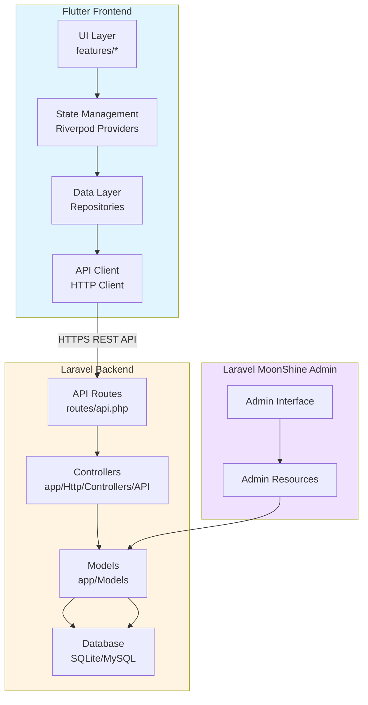
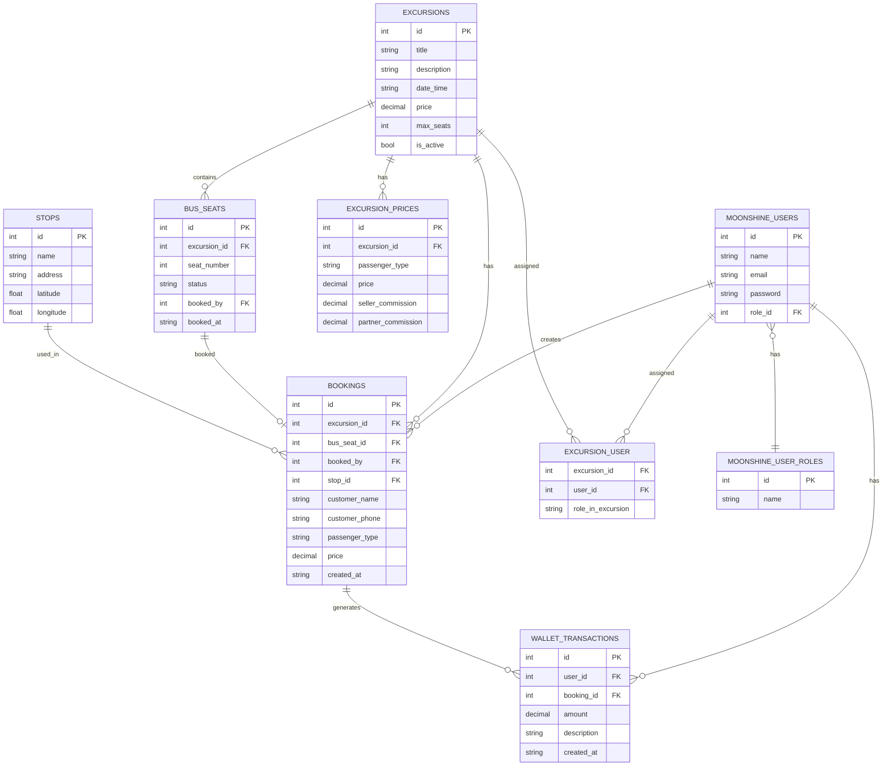
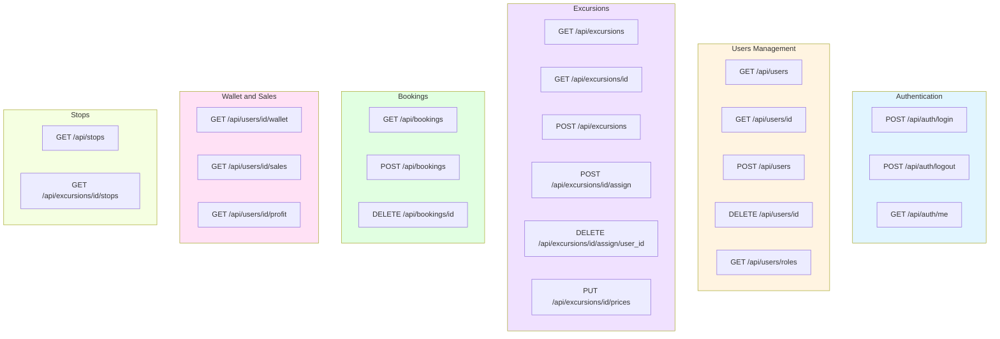
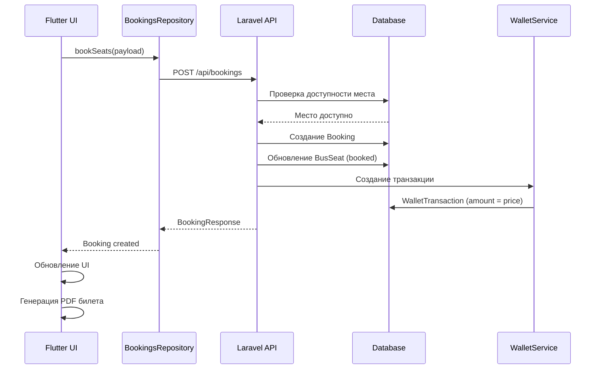
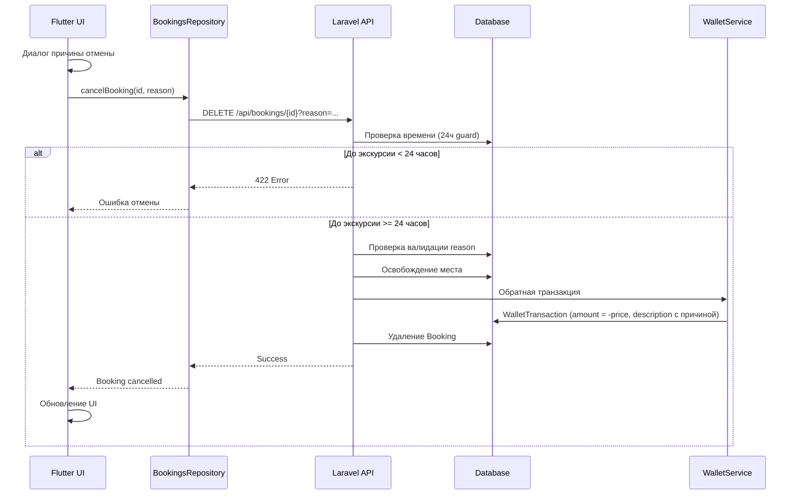
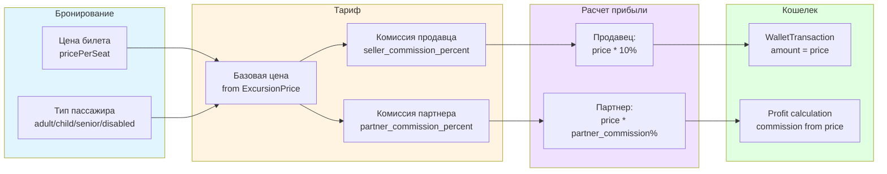
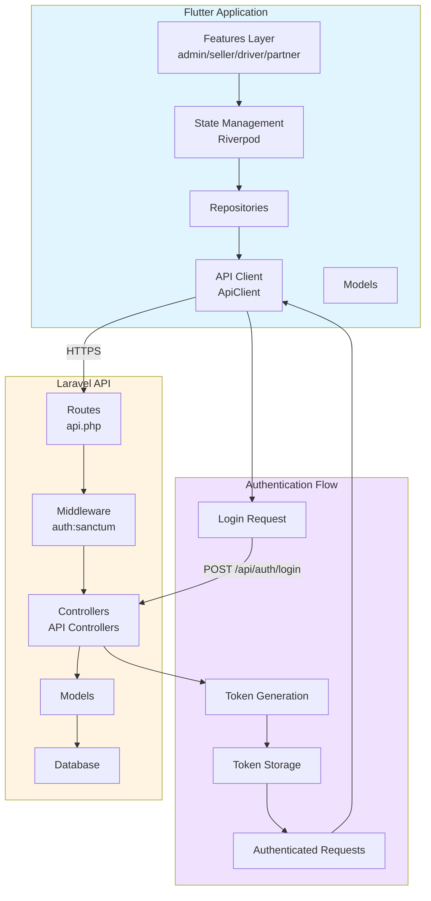
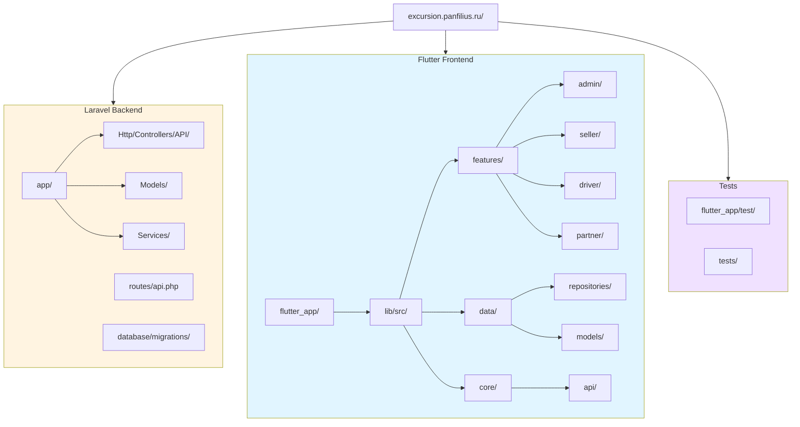

# Архитектурные диаграммы проекта Excursion Booking System

## 1. Общая архитектура системы



## 2. Схема базы данных (ER Diagram)



## 3. Схема API Endpoints



## 4. Поток данных: Бронирование места



## 5. Поток данных: Отмена бронирования



## 6. Архитектура ролей и прав доступа

```mermaid
graph TB
    subgraph Roles["Роли пользователей"]
        A["Admin<br/>role_id: 1"]
        S["Seller<br/>role_id: 2"]
        D["Driver<br/>role_id: 3"]
        P["Partner<br/>role_id: 4"]
    end
    
    subgraph AdminPerms["Права администратора"]
        A1["Создание экскурсий"]
        A2["Управление тарифами"]
        A3["Назначение сотрудников"]
        A4["Управление пользователями"]
        A5["Просмотр всех данных"]
    end
    
    subgraph SellerPerms["Права продавца"]
        S1["Бронирование мест"]
        S2["Отмена бронирований"]
        S3["Просмотр прибыли 10 процентов"]
        S4["Генерация билетов"]
    end
    
    subgraph DriverPerms["Права водителя"]
        D1["Просмотр назначенных экскурсий"]
        D2["Просмотр расписания"]
    end
    
    subgraph PartnerPerms["Права партнера"]
        P1["Просмотр прибыли с комиссией"]
        P2["Просмотр статистики"]
    end
    
    A --> A1
    A --> A2
    A --> A3
    A --> A4
    A --> A5
    
    S --> S1
    S --> S2
    S --> S3
    S --> S4
    
    D --> D1
    D --> D2
    
    P --> P1
    P --> P2
    
    style A fill:#ff6b6b
    style S fill:#4ecdc4
    style D fill:#95e1d3
    style P fill:#f38181
```



## 7. Схема расчета прибыли



## 8. Схема взаимодействия Frontend и Backend



## 9. Структура директорий проекта



## Инструменты для генерации диаграмм

### Используемые инструменты:
1. **Mermaid** - уже используется в проекте (ARCHITECTURE.md)
   - Поддерживается GitHub, GitLab, VS Code
   - Можно рендерить в HTML

### Дополнительные инструменты для Laravel:
1. **Laravel ER Diagram Generator** (composer пакет):
   ```bash
   composer require --dev beyondcode/laravel-erd-generator
   php artisan generate:erd
   ```

2. **Laravel Visual Modeler**:
   ```bash
   composer require --dev laravel-modeler/laravel-modeler
   ```

3. **PlantUML** (универсальный):
   - Установить PlantUML
   - Создать .puml файлы
   - Генерировать PNG/SVG

### Рекомендации:
- **Mermaid** - для документации в README/MD файлах (уже используется)
- **Laravel ER Generator** - для автоматической генерации ER диаграмм из миграций
- **PlantUML** - для более сложных UML диаграмм (sequence, class diagrams)

